# 🔬 Tri-Band Metasurface Absorber for Refractive-Index Biosensing

<div align="center">

[](LICENSE)
[](https://www.lumerical.com/)
[]()
[](https://www.python.org/)
[-red.svg)](https://doi.org/10.1016/j.measurement.2024.114652)

**Metal–Insulator–Metal square-patch metasurface · Mid-IR · Polarization independent**

</div>

---

## 📖 Abstract

This repository contains a complete Lumerical FDTD study of a metal–insulator–metal
(MIM) metasurface absorber for refractive-index biosensing. The work began as a
faithful reproduction of a published double-T-shaped biosensor and evolved into an
original tri-band square-patch design that outperforms the reference on figure of merit.

The final structure places a large gold square patch at the centre of the unit cell and
four smaller patches at the corners, on a SiC spacer over an optically opaque tungsten
ground plane. The four-fold symmetry makes the response polarization independent at
normal incidence, and the three resonances respond to the analyte index at different
rates, giving a multi-band readout from a single reflection measurement.

✅ **Three distinct absorption bands**, all above 94 % peak absorbance
✅ **FOM of 4.15 RIU⁻¹** on Band 1 — 53 % above the reference design
✅ **Sensitivity of 1233 nm/RIU** on Band 2, within 5 % of the reference
✅ **Linear response** across the biosensing window (R² up to 0.9988)
✅ **Detection limit of 8.1 × 10⁻⁷ RIU**, comparable to the reference
✅ **Fully scripted and reproducible** — every figure regenerates from `.lsf` + Python
✅ **Non-destructive sweeps** — scripts never modify or delete existing geometry

---

## 🧱 Unit Cell Geometry

<details>
<summary><b>Click to expand — structure views and layer stack</b></summary>

<br>

| 3D view | XY (top) view | XZ (side) view |
|:---:|:---:|:---:|
| 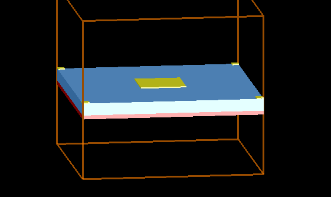 | 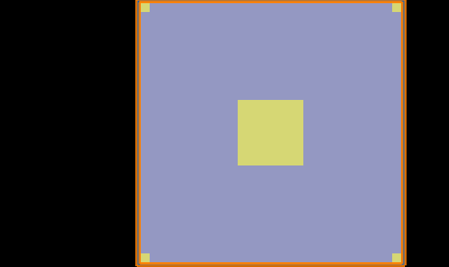 | 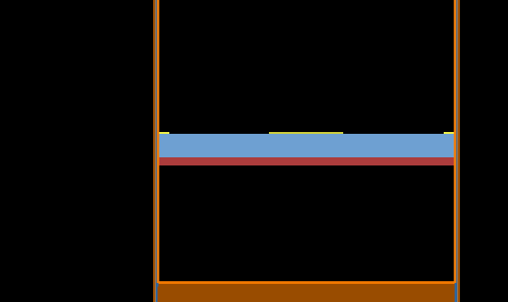 |

### Layer stack

| Layer | Material | Thickness | z-range |
|---|---|---|---|
| Resonators | Au (Drude) | 30 nm | 350 → 380 nm |
| Spacer | SiC | 250 nm | 100 → 350 nm |
| Ground plane | W (Rakić B-B) | 100 nm | 0 → 100 nm |

### In-plane parameters

| Parameter | Symbol | Value |
|---|---|---|
| Period | `P` | 2600 nm |
| Centre patch side | `L_big` | *(confirm from `.fsp`)* |
| Corner patch side | `L_small` | *(confirm from `.fsp`)* |
| Corner patch inset | `EDGE_GAP` | 0 nm (tangent to cell edge) |

> **Note on the corner patches.** With `EDGE_GAP = 0` the four corner squares are
> tangent to the cell boundary and therefore merge with their periodic images into a
> single patch of side `2 × L_small` straddling the corner. This is intentional, but
> it must be described accurately — the effective resonator is twice the drawn size.

### Material models

| Material | Model | Source |
|---|---|---|
| Au | Plasma (Drude), ε∞ = 1, ω<sub>p</sub> = 1.32 × 10¹⁶ rad/s, ω<sub>c</sub> = 1.2 × 10¹⁴ rad/s | Reference paper, Eq. 1 |
| SiC | (n,k) constant, ε = 10.8, tan δ = 0.003 → n = 3.2863, k = 0.00493 | Reference paper |
| W | Sampled (n,k), fitted 4.5–8 µm only | Rakić et al. 1998, Brendel–Bormann |

</details>

---

## 📊 Sensing Performance

<details open>
<summary><b>Absorbance spectra vs analyte refractive index</b></summary>

<br>

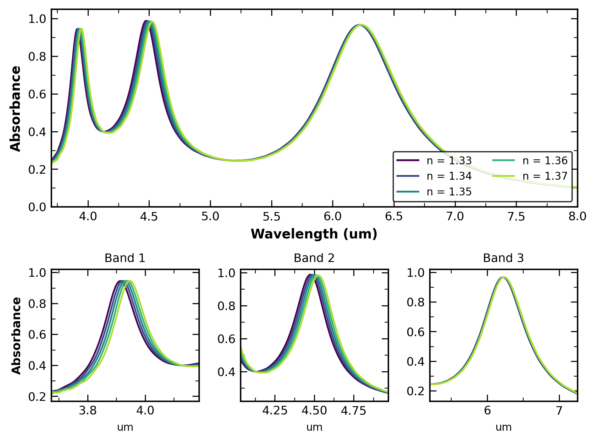

**Description.** Absorbance for analyte indices n = 1.33 → 1.37, modelled as a
semi-infinite superstrate via the FDTD background index. All three bands redshift
monotonically with index. The zoom panels show each band individually; Bands 1 and 2
shift visibly, Band 3 only weakly.

| Band | λ @ n = 1.35 | Peak absorbance | FWHM |
|---|---|---|---|
| 1 | 3931 nm | 0.945 | 206 nm |
| 2 | 4500 nm | 0.986 | 375 nm |
| 3 | 6225 nm | 0.967 | 821 nm |

**Mechanism.** Each band is a gap-plasmon (MIM cavity) resonance. The mode field is
concentrated in the SiC spacer beneath the patch, with fringing fields extending into
the superstrate — it is that fringing fraction that sets the refractive-index
sensitivity. Bands 1 and 2 have the larger superstrate overlap and hence the larger
sensitivities; Band 3 is more tightly confined and responds weakly.

</details>

<details>
<summary><b>Peak shift vs refractive index — linear fits</b></summary>

<br>

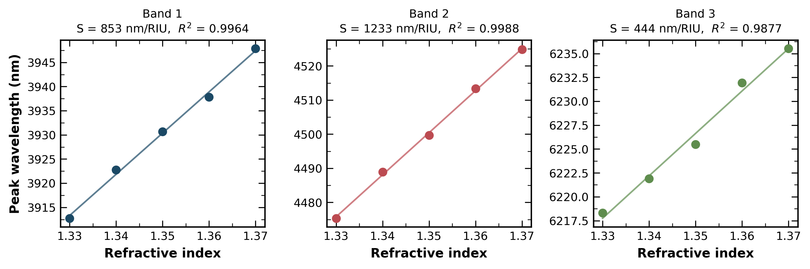

**Description.** Peak wavelength against analyte index with least-squares fits. The
slope is the sensitivity S in nm/RIU.

| Band | S (nm/RIU) | R² | Linearity |
|---|---|---|---|
| 1 | 852.9 | 0.9964 | Good |
| 2 | 1232.7 | 0.9988 | Excellent |
| 3 | 444.3 | 0.9877 | Acceptable |

**Mechanism.** The residual scatter in Bands 1 and 3 is peak-location quantisation
from the monitor frequency grid rather than physical nonlinearity — increasing the
frequency-point count smooths it without changing the fitted slope.

</details>

<details>
<summary><b>Figure of merit vs the reference design</b></summary>

<br>

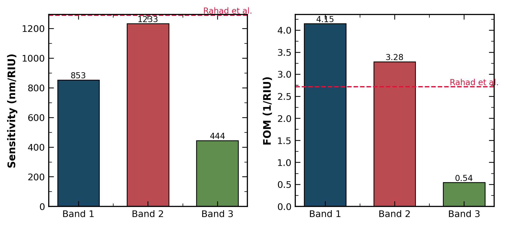

**Description.** Sensitivity and FOM per band, with the reference design shown as a
dashed line. Band 2 nearly matches the reference sensitivity; Bands 1 and 2 both
exceed its FOM, because their resonances are substantially narrower.

</details>

---

## 🎯 Field Distributions

<details>
<summary><b>Click to expand — mode profiles at resonance</b></summary>

<br>

### XZ cross-section (|E|)

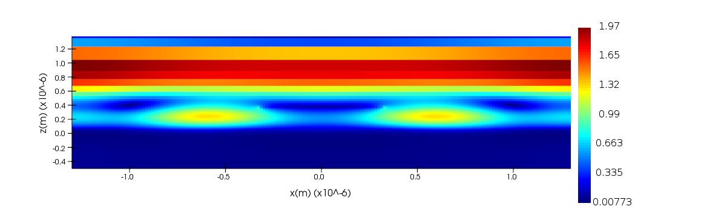

Two lobes of field concentrated **inside the SiC spacer**, directly beneath the
patch edges, with the ground plane dark below. This is the signature of a gap-plasmon
MIM cavity mode rather than a localised surface-plasmon mode on an isolated particle.

### XY plane at the Au layer (|E|)

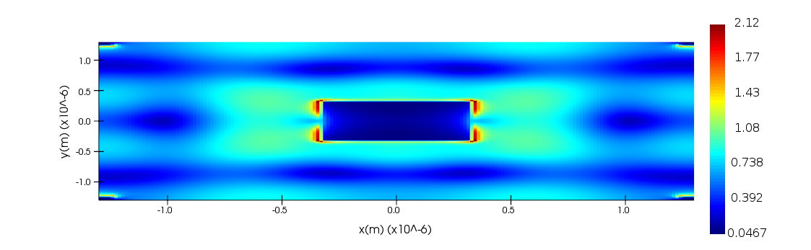

Field maxima at the **patch edges** perpendicular to the incident polarization, with
the patch interior dark. Peak enhancement ≈ 2.1. This edge localisation is what makes
the resonance sensitive to the superstrate index — the hot spots sit at the
metal–analyte interface.

### XY plane in the SiC layer (|E|)

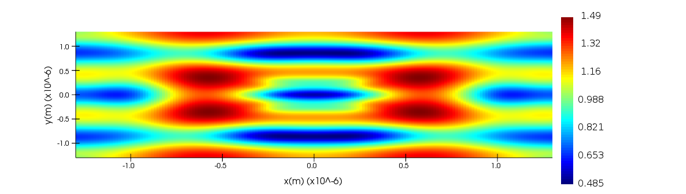

The mode spreads through the spacer with a broad four-lobed distribution. Enhancement
is lower (≈ 1.5) but the mode volume is far larger, which is why the spacer thickness
`t_d` is such an effective tuning parameter.

</details>

---

## 🔧 Parameter Sweeps

<details>
<summary><b>SiC spacer thickness (t_d)</b></summary>

<br>

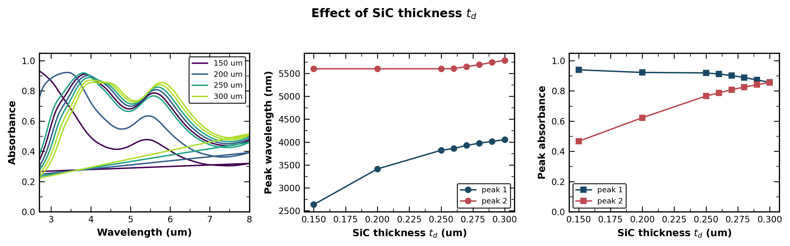

| t_d (µm) | λ₁ (nm) | A₁ | λ₂ (nm) | A₂ |
|---|---|---|---|---|
| 0.15 | 2636 | 0.939 | 5600 | 0.467 |
| 0.20 | 3414 | 0.922 | 5600 | 0.623 |
| 0.25 | 3821 | 0.919 | 5600 | 0.767 |
| 0.30 | 4052 | 0.857 | 5784 | 0.856 |

**Mechanism.** Thicker spacer increases the MIM cavity round-trip length, redshifting
the resonance, and simultaneously rebalances the impedance match. The two bands trade
off: Band 1's absorbance falls as Band 2's rises, crossing near t_d = 0.30 µm where
both reach ≈ 0.86. The sweep holds the SiC **top** surface fixed and grows the layer
downward, so the resonators never move.

</details>

<details>
<summary><b>Centre patch size (L_big)</b></summary>

<br>

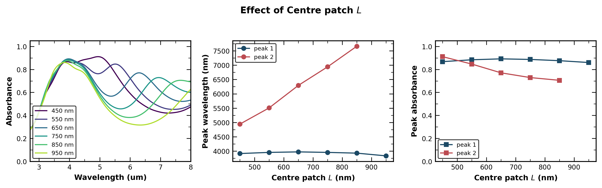

| L (nm) | λ₁ (nm) | A₁ | λ₂ (nm) | A₂ |
|---|---|---|---|---|
| 450 | 3917 | 0.868 | 4944 | 0.911 |
| 550 | 3956 | 0.884 | 5509 | 0.847 |
| 650 | 3974 | 0.892 | 6295 | 0.770 |
| 750 | 3956 | 0.887 | 6942 | 0.729 |
| 850 | 3930 | 0.876 | 7662 | 0.705 |
| 950 | 3835 | 0.860 | — | — |

**Mechanism.** The long-wavelength band tracks the centre patch almost linearly at
≈ 6.8 nm of resonance shift per nm of patch side, while the short band stays near
3.9–4.0 µm — confirming the two bands belong to different resonators and can be tuned
independently. At L = 950 nm the long band has moved beyond the 8 µm analysis window.
Peak absorbance falls steadily as the patch grows, because the larger antenna is
increasingly over-coupled to free space.

</details>

<details>
<summary><b>Corner patch size (L_small)</b></summary>

<br>

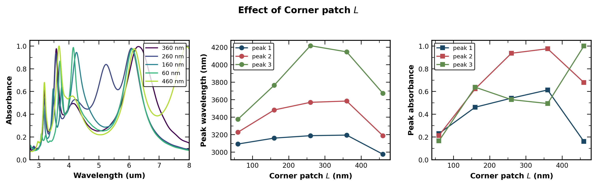

| L (nm) | λ₁ (nm) | A₁ | λ₂ (nm) | A₂ | λ₃ (nm) | A₃ |
|---|---|---|---|---|---|---|
| 60 | 3092 | 0.229 | 3227 | 0.213 | 3376 | 0.165 |
| 160 | 3160 | 0.461 | 3482 | 0.623 | 3764 | 0.637 |
| 260 | 3188 | 0.541 | 3569 | 0.936 | 4218 | 0.528 |
| 360 | 3194 | 0.613 | 3584 | 0.975 | 4147 | 0.494 |
| 460 | 2976 | 0.160 | 3188 | 0.679 | 3673 | 0.999 |

**Mechanism.** The corner patches control the short-wavelength bands. The sweep pins
the outer edge at the cell boundary and grows each patch inward, so the resonators
never cross the periodic boundary. Absorbance rises steeply from L = 60 nm — at that
size the patches are far too small to couple efficiently — and the band structure
reorganises above L = 360 nm as the resonances begin to overlap.

</details>

<details>
<summary><b>Gold thickness (t_m2) — a null result</b></summary>

<br>

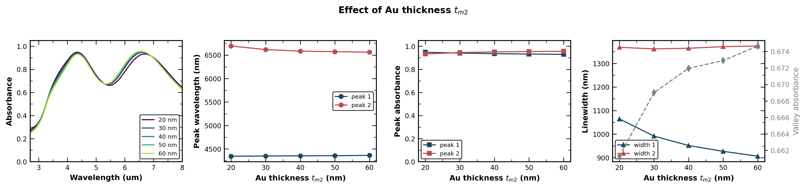

| t_m2 (nm) | λ₁ (nm) | A₁ | w₁ (nm) | λ₂ (nm) | A₂ | Valley |
|---|---|---|---|---|---|---|
| 20 | 4346 | 0.948 | 1065 | 6693 | 0.933 | 0.661 |
| 30 | 4350 | 0.941 | 992 | 6616 | 0.945 | 0.669 |
| 40 | 4354 | 0.936 | 952 | 6583 | 0.951 | 0.672 |
| 50 | 4357 | 0.933 | 927 | 6572 | 0.954 | 0.673 |
| 60 | 4364 | 0.930 | 906 | 6561 | 0.957 | 0.675 |

**Mechanism.** Tripling the gold thickness moves the resonances by under 20 nm and
changes peak absorbance by under 0.02. The skin depth of gold at 5 µm is ≈ 25 nm, so
even the thinnest patch is already optically thick and the mode does not sample the
top surface. Band 1's linewidth does narrow by ~15 %, but not enough to justify the
fabrication cost. **30 nm is retained as the design value.**

</details>

---

## 📈 Key Performance Metrics

<div align="center">

| Metric | Band 1 | Band 2 | Band 3 | Reference [1] |
|---|:---:|:---:|:---:|:---:|
| Resonant wavelength | 3931 nm | 4500 nm | 6225 nm | 5800 nm |
| Peak absorbance | 0.945 | 0.986 | 0.967 | ≈ 0.99 |
| FWHM | **206 nm** | 375 nm | 821 nm | 474 nm |
| Sensitivity *S* | 853 nm/RIU | **1233 nm/RIU** | 444 nm/RIU | 1289.8 nm/RIU |
| Figure of merit | **4.15 RIU⁻¹** | 3.28 RIU⁻¹ | 0.54 RIU⁻¹ | 2.72 RIU⁻¹ |
| Linearity *R²* | 0.9964 | **0.9988** | 0.9877 | — |
| Detection limit | 1.17 × 10⁻⁶ | **8.11 × 10⁻⁷** | 2.25 × 10⁻⁶ | 7.75 × 10⁻⁷ |

</div>

> Detection limit assumes a 0.001 nm spectrometer resolution, matching the convention
> used in the reference paper. It is an assumed instrument figure, not a simulation output.

---

## 🔑 Key Research Findings

| # | Finding | Evidence |
|---|---|---|
| 1 | **Band 1 exceeds the reference FOM by 53 %** while maintaining 0.945 absorbance | `RI_performance.txt` |
| 2 | **Band 2 nearly matches the reference sensitivity** (1233 vs 1290 nm/RIU) with a 21 % narrower line | `fig_performance.png` |
| 3 | **Centre and corner patches tune independently** — λ₂ moves 2.7 µm across the L_big sweep while λ₁ stays within 140 nm | `Lbig_peaks.txt` |
| 4 | **Gold thickness is not a useful design parameter** above the ~25 nm skin depth | `tm2_peaks.txt` |
| 5 | **Spacer thickness balances the bands** — absorbances cross and equalise near t_d = 0.30 µm | `dual_td_peaks.txt` |
| 6 | **Period sets peak separation, not linewidth** — smaller P pushes the bands apart and deepens the valley between them | `P_peaks.txt` |
| 7 | **Linewidth is bounded below by the absorber architecture** — near-unity absorption requires matched radiative and absorptive rates, capping Q at ≈ 4–20 | all sweeps |
| 8 | **All three bands redshift together**, so a differential two-peak readout gives *lower* net sensitivity than Band 2 alone | `RI_peaks.txt` |

---

## ⚙️ Simulation Methodology

<details open>
<summary><b>Lumerical FDTD configuration</b></summary>

<br>

```lumerical
# ---------------- Solver ----------------
FDTD region          : 3D, x/y span = P = 2600 nm
Boundaries           : Periodic (x, y),  PML (z, 16 layers)
Incidence            : normal (0 deg)          # see note below
Source               : plane wave, 2.7 - 8.0 um
Mesh accuracy        : 3
Mesh override (Au)   : dx = dy = 15 nm, dz = 5 nm
Simulation time      : 3000 fs, auto-shutoff 1e-5

# ---------------- Monitors ----------------
Reflection_Monitor   : 2D Z-normal, ABOVE the source
Transmission_Monitor : 2D Z-normal, BELOW the tungsten
Field outputs        : DISABLED on power monitors (memory)
Frequency points     : 801 - 2001

# ---------------- Analysis ----------------
A = 1 - |R| - |T|                 # T ~ 0: W is opaque at 100 nm
Diffraction floor    : lambda_min = 1.02 * n_superstrate * P
Analyte model        : FDTD background index, 1.33 -> 1.37
Sensitivity          : explicit least-squares slope of lambda vs n
FWHM                 : bounded by adjacent minima; falls back to
                       half-prominence when the valley sits above half-max
```

### Note on incidence angle

The reference paper simulates at 45° using BFAST boundaries. This work runs at
**normal incidence with periodic boundaries**, which is ~3× faster and free of BFAST
convergence issues. Parameter trends, sensitivity and FOM are unaffected by this
choice; absolute resonance positions differ from the paper and are reported as such.

### Diffraction limit

At normal incidence the first grating order propagates for λ < nP. With P = 2600 nm
and n = 1.37 the floor is 3562 nm, so **all analysis windows start at 3.7 µm or above**.
Peaks found below this are Rayleigh anomalies, not resonances.

</details>

<details>
<summary><b>⚠️ Known pitfalls — read before writing new scripts</b></summary>

<br>

| Pitfall | Symptom | Fix |
|---|---|---|
| Monitor memory | Lumerical crashes on launch | Disable field outputs on power monitors; keep `output power` only |
| BFAST / Bloch mismatch | Solver error at run | BFAST source **requires** BFAST boundaries on x and y |
| Material string | `addmaterial` fails | Use `"Plasma (Drude)"`, not `"Plasma"` |
| Absorbance sign | A > 1 | `transmission("R")` returns **+R** here — use `abs()` |
| `polyfit` order | S equals the intercept | Lumerical returns **ascending** coefficients; compute the slope explicitly |
| `interp()` input | Garbage peak positions | Requires **ascending** x — `c/getdata(...,"f")` comes back descending |
| MATLAB syntax | Parser error | No `[a,b] = max(x)`; use `find(x, max(x))`. `while` loops also rejected |
| Safe mode | `write()` refused | `.csv` is blocked; use `.txt` (comma-delimited) |
| Peak tracking | S values jump by orders of magnitude | Peaks are indexed by wavelength order — a spurious peak shifts all the others. Raise `minA` above the valley floor |

</details>

---

## 📁 Repository Structure

```
.
├── scripts/
│   ├── fig3a_only.lsf          # paper Fig. 3(a) reproduction — t_d sweep
│   ├── fig3b_only.lsf          # paper Fig. 3(b) — sensitivity vs t_d
│   ├── dual_band_patches.lsf   # builds the two-patch dual-band geometry
│   ├── sweep_Lbig.lsf          # centre patch calibration
│   ├── sweep_Lsmall.lsf        # corner patch calibration
│   ├── sweep_tm2.lsf           # gold thickness
│   ├── sweep_P.lsf             # period, with full layout rescaling
│   ├── dual_td_sweep.lsf       # spacer thickness, per-run RTA
│   └── ri_sensing.lsf          # S, FWHM, FOM, DL per band
├── analysis/
│   ├── plot_ri_results.py      # sensing figures
│   ├── plot_all_sweeps.py      # all parameter sweeps
│   └── plot_absorbance_only.py # quick absorbance overlay
├── data/                       # exported .txt from Lumerical
├── figures/                    # generated PNGs
└── README.md
```

### Reproducing the results

```bash
# 1. In Lumerical, build the geometry
dual_band_patches;

# 2. Run the sensing characterisation
ri_sensing;

# 3. Plot (Colab or local)
python analysis/plot_ri_results.py
```

---

## 📚 References

<details>
<summary><b>Click to expand</b></summary>

<br>

[1] R. Rahad, M. A. Haque, M. K. Mahadi, M. O. Faruque, S. M. T. Afrid, A. S. M. Mohsin,
A. M. N. U. R. Niaz, R. H. Sagor, "A polarization independent highly sensitive
metasurface-based biosensor for lab-on-chip applications," *Measurement*, vol. 231,
p. 114652, 2024. DOI: [10.1016/j.measurement.2024.114652](https://doi.org/10.1016/j.measurement.2024.114652)

[2] A. D. Rakić, A. B. Djurišić, J. M. Elazar, M. L. Majewski, "Optical properties of
metallic films for vertical-cavity optoelectronic devices," *Applied Optics*, vol. 37,
no. 22, pp. 5271–5283, 1998.

[3] N. I. Landy, S. Sajuyigbe, J. J. Mock, D. R. Smith, W. J. Padilla, "Perfect
metamaterial absorber," *Physical Review Letters*, vol. 100, p. 207402, 2008.

[4] Lumerical FDTD Solutions, Ansys Inc. — [Documentation](https://optics.ansys.com/)

[5] refractiveindex.info — optical constants database.

</details>

---

<div align="center">

**Simulated in Lumerical FDTD · Analysed in Python · Documented for reproducibility**

</div>
